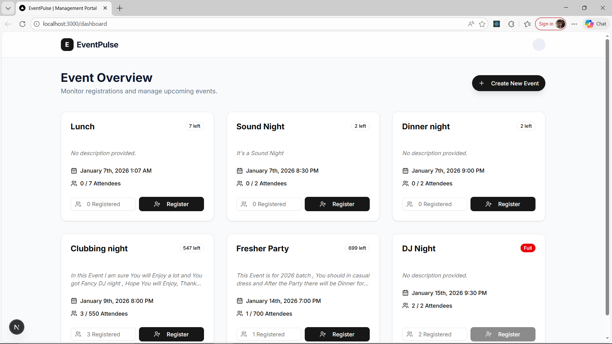
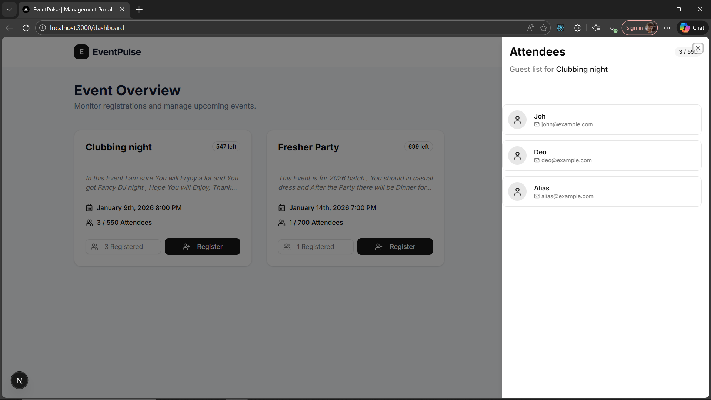
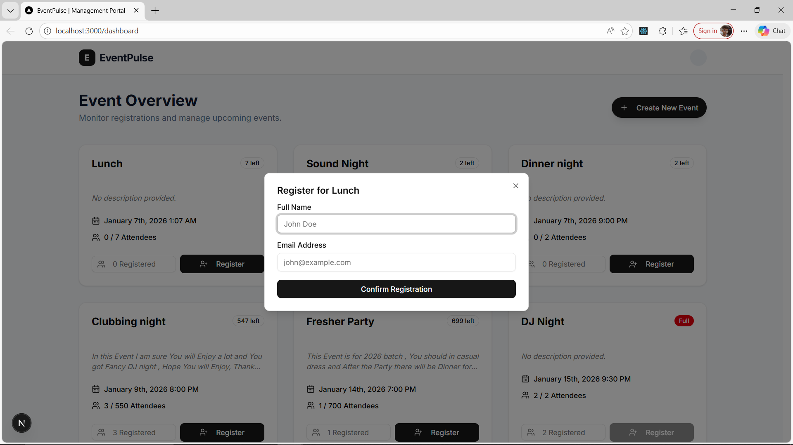
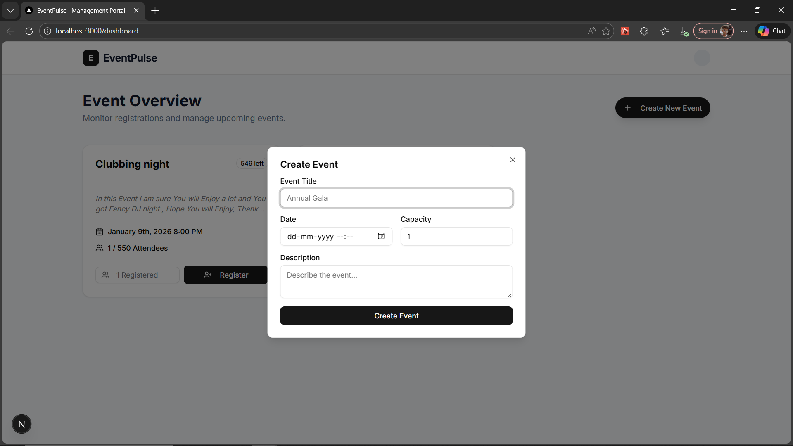

# 🚀 EventPulse: Modern Event Management Portal

**Author:** Aman 

EventPulse is a professional full-stack dashboard built to manage events and attendee registrations with high performance and a premium user experience.

---

## 📸 Project Showcases

### 1. Main Dashboard
A clean, card-based interface showing all upcoming events with real-time status badges.



---

### 2. Relational Attendee View
Using Shadcn Sheets and ScrollArea to display linked data (Attendees) for specific events.



---

### 3. Secure Registration
A validated form using React Hook Form and Zod to handle attendee sign-ups.



---

### 4. Event Management
An administrative interface to create and store events with capacity limits.



---

## 🛠️ Technical Maturity (Core Highlights)

- **Server-State Management**: Used **TanStack Query** for smart caching, background revalidation, and reducing unnecessary API calls.
- **Optimistic UI & Feedback**: Integrated **Sonner** for instant toast notifications and used state-driven UI to provide immediate feedback on user actions.
- **Database Excellence**: Implemented a relational schema using **Prisma ORM** with a Singleton pattern to optimize connection pooling.
- **Form Integrity**: Combined **React Hook Form** with **Zod** for schema-based validation, ensuring data consistency between the frontend and the SQLite database.
- **Polished UX**: Implemented **Loading Skeletons**, custom **Scroll Areas**, and graceful empty states to ensure a professional look and feel.

---

## ⚙️ Tech Stack

- **Framework**: Next.js 16 (App Router)
- **Database**: SQLite + Prisma ORM
- **UI Library**: Shadcn/UI + Tailwind CSS
- **State Management**: TanStack Query (v5)
- **Validation**: Zod
- **Icons**: Lucide React

---

## 🚀 Setup & Installation

1. **Clone & Install**:
   ```bash
   git clone [https://github.com/ABit908/Event_portal](https://github.com/ABit908/Event_portal)
   cd Event_portal
   npm install
